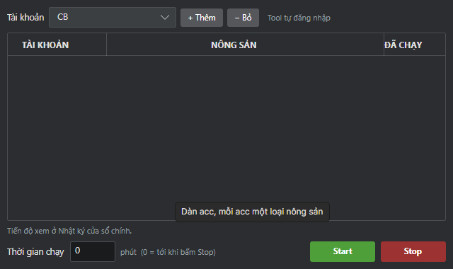
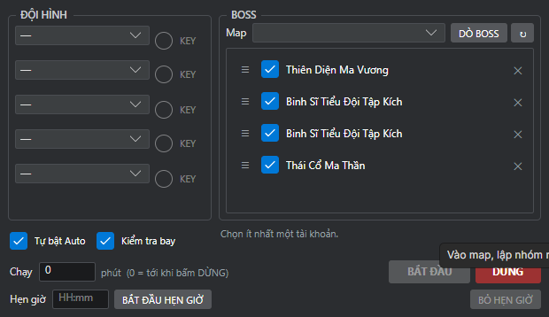

# Đặc tả đầy đủ tool VPT Auto — theo từng cửa sổ/tính năng

Tài liệu này chụp lại **đúng UI đang chạy thật** (build Release
`avalonia_ui\VptAvalonia\bin\Release\net8.0\VptAvalonia.exe`, chụp ngày
2026-08-24), không phải mô tả gộp. Mỗi mục theo template:

> **Tên** — **Mục đích** — **Vị trí trong UI** — **Input/cấu hình** —
> **Luồng hoạt động** — **Kết quả mong đợi** — **Trạng thái thực tế** — **Ảnh**

Dùng file này để giao cho dev khác hoặc để chủ dự án sửa lại mô tả cho đúng ý
mình — sau khi sửa, agent sẽ đối chiếu và config lại tool cho khớp, không tự
chắp vá theo suy đoán nữa.

**Quy ước trạng thái:**
- ✅ Hoàn thiện — có logic thật, đã kiểm chứng ít nhất một phần trên client thật
- 🟡 Một phần — có logic nhưng chưa đủ/chưa test hết
- ❌ Placeholder — giao diện có sẵn nhưng CHƯA nối backend, bấm không làm gì
  (xác nhận bằng cách bấm thật và quan sát, không suy đoán)

---

## 0. Cửa sổ chính

**Mục đích:** trung tâm điều khiển — quản lý danh sách tài khoản, mở/đóng
game, chọn tính năng cần cấu hình.

**Các vùng:**
- **Thông tin** (trái trên): thêm/sửa/xoá 1 tài khoản (Tên, Link đăng nhập,
  FPS, tuỳ chọn "Mở trùng tab").
- **Nhật ký** (trái dưới): log hoạt động real-time, có thể bật/tắt hiển thị.
- **Danh sách tài khoản đã lưu** (phải trên): bảng account (STT/Tên/Kênh/
  FPS/PID/trạng thái chấm tròn), tick chọn account để thao tác.
- **Hàng nút điều khiển account:** VÀO GAME / VÀO ALL / AUTO ALL / NGỪNG AUTO
  / DỪNG ALL, và hàng phụ: Hiển thị lên đầu / Sắp xếp CS / Ẩn (đã GPU) / Ẩn
  taskbar / Hiện / Đóng CS.
- **Thao tác** (dưới): 6 tab con — Daily, Cài đặt, Sổ Tay, Tự động hoàn toàn,
  Bắt Pet, AutoClick (chi tiết từng tab ở các mục bên dưới).

**Trạng thái: ✅ khung chính hoàn thiện.** Chưa kiểm từng nút VÀO GAME/AUTO
ALL/... bằng test riêng trong tài liệu này (đã kiểm gián tiếp qua các phiên
test Daily/Dungeon trước đó).

---

## 1. Tab "Daily"

**Mục đích:** cấu hình và chạy chuỗi nhiệm vụ ngày tự động cho account đang
tick trong danh sách phía trên.

**Input/cấu hình:** tick các checkbox tương ứng bước muốn chạy — VIP + thời
trang, Chế mật bảo (kèm số lượt), Nhận điêu khắc, Auto phụ bản (kèm nút "..."
mở cấu hình chi tiết từng phụ bản), Thần tu (15 phút), Nhận hành lang, Tu
hành, Lật thẻ bài (kèm số lượt).
*(Cập nhật 2026-08-24: bước "Cho TL ăn" đã gỡ; lưới checkbox đã sắp lại khớp
đúng thứ tự chạy Daily — đọc từ trên xuống trong cột, rồi sang cột kế.)*

**Luồng hoạt động:** bấm "CHẠY AUTO" → chạy đúng các bước đã tick, theo thứ
tự canonical cố định (xem `docs/DAILY_FLOW_CANONICAL.md`), không phụ thuộc
thứ tự tick. "DỪNG DAILY" dừng account đang tick (không tick thì dừng mọi
Daily đang chạy).

**Kết quả mong đợi:** Daily chạy hết các bước đã chọn, log hiển thị tiến độ
từng bước, tự đóng/mở lại Flash đúng lịch khi có Auto phụ bản + Thần Tu/Tu
Hành.

**Trạng thái: ✅ hoàn thiện cho các route đã đo** (xem chi tiết từng bước ở
mục 4 "Daily — chi tiết từng bước" bên dưới). Bước nào chưa có bằng chứng đo
đạc thật sẽ báo lỗi rõ ràng thay vì tự bấm liều.

**Lưu ý quan trọng:** phía dưới 8 checkbox này còn có **1 lưới nút riêng biệt**
(THẦN TU / TRỪ MA / TRỊ AN / ĐẤU PET / TU HÀNH / NV BANG / LẬP NHÓM / MẬT BẢO
/ LẬT BÀI / PHỤ BẢN / N.TRƯỜNG / HÁI/CÂU / ĐIÊU KHẮC) — **CHƯA XÁC ĐỊNH được
các nút này dùng để làm gì** (bấm thử riêng lẻ 1 nhiệm vụ? hay chỉ hiển thị
minh hoạ?). Cần chủ dự án mô tả rõ mục đích của lưới nút này.

---

## 2. Tab "Cài đặt"

**Mục đích:** cấu hình chi tiết bổ sung cho account đang chọn, ngoài phạm vi
Daily.

**Các mục nhìn thấy (CHƯA rõ mục đích chi tiết — cần chủ dự án mô tả):**
- "Lựa chọn Mật Bảo" — 2 dropdown, chưa rõ khác gì với "Chế mật bảo" ở tab
  Daily.
- "Trống trang viên với" — dropdown + nút "Trống".
- "Đổi năng nổ với" — dropdown + nút "Đổi".
- "Nông trường" — dropdown + nút "Trống".
- **"Cài đặt phụ bản"** (phải): danh sách phụ bản (Mê Huyễn Động, Kho Báu Đại
  Mạc, Lục Tiên Cảnh, Liệt Diễm Thâm Uyên, Trở Lại Lang Huyệt, còn cuộn thêm)
  — tick chọn + số lượt (1-3) từng phụ bản. Đây chính là config được
  `DungeonRunner`/`advance()` đọc để biết chạy phụ bản nào mấy lượt (đã xác
  nhận qua `configs/dungeon_accounts.json`).

**Trạng thái: 🟡 một phần.** "Cài đặt phụ bản" đã xác nhận hoạt động thật
(dùng trong toàn bộ test Auto Phụ Bản trước đó). 3 mục "Trống trang viên",
"Đổi năng nổ", "Nông trường" **CHƯA kiểm chứng có hoạt động hay chỉ giao
diện** — chưa bấm thử vì không rõ hậu quả trên tài khoản thật (không tự ý
bấm khi chưa biết nó làm gì).

---

## 3. Tab "Sổ Tay" (Auto Boss theo sổ)

**Mục đích:** chạy Auto Boss theo danh sách boss đã lưu (khác với cửa sổ
"Auto Boss Team" ở mục 6.3 — đây có vẻ là chế độ chạy boss đơn giản hơn, lặp
qua danh sách đã tick).

**Input:** dropdown Loại Boss, dropdown Trạng thái, bảng danh sách boss
(Chọn/Boss/Loại/Lượt) — hiện đang trống ("Tổng: 0 lượt").

**Luồng hoạt động:** tick chọn boss cần đánh → bấm "CHẠY SỔ TAY".

**Trạng thái: 🟡 chưa kiểm chứng** — bảng đang trống (chưa có dữ liệu boss đã
"dò" cho account đang chọn). Cần dò boss (qua cửa sổ Auto Boss Team, nút "DÒ
BOSS") trước mới có dữ liệu để test tab này.

---

## 4. Tab "Tự động hoàn toàn"

**Mục đích:** trung tâm mở các cửa sổ cấu hình chạy nhiều tài khoản cùng lúc
cho từng tính năng lớn.

Kết quả bấm thử **từng nút thật** (không suy đoán):

| Nút | Kết quả khi bấm | Trạng thái |
|---|---|---|
| CÂU/HÁI | Mở cửa sổ "Tự động Câu/Hái nhiều tài khoản" | ✅ thật (mục 6.1) |
| TRAIN | Mở cửa sổ "Tự động Train" | ✅ thật (mục 6.2) |
| AUTO BOSS | Mở cửa sổ "Auto Boss Team" | ✅ thật (mục 6.3) |
| DAILY | Không mở gì | ❌ hoặc trỏ sang tab Daily chính — chưa rõ, cần hỏi lại |
| LOGIN CLONE | Không mở gì | ❌ placeholder |
| BẮT PET | Không mở gì | ❌ placeholder (trùng với tab "Bắt Pet" cũng placeholder) |
| PHỤ BẢN | Không mở gì | ❌ placeholder (Auto Phụ Bản thật nằm trong Daily, không phải ở đây) |
| N.TRƯỜNG (Đấu Trường?) | Không mở gì | ❌ placeholder |
| BANG HỘI | Không mở gì | ❌ placeholder |

Dòng ghi chú trong UI xác nhận: *"Nút mở là chức năng chưa làm — dựng sẵn
chỗ để thêm sau."*

---

## 5. Tab "Bắt Pet"

**Mục đích (dự kiến, chưa làm):** tự động đi bắt pet theo map + loại pet chọn
trước, dừng nếu không gặp pet cần bắt.

**Trạng thái: ❌ Placeholder — chính UI ghi rõ:** *"Chưa nối backend — giao
diện dựng trước để chốt bố cục."* Nút "BẮT ĐẦU BẮT PET"/"DỪNG" bị khoá (mờ),
không bấm được.

---

## 6. Tab "AutoClick"

**Mục đích:** công cụ click-macro tổng quát — người dùng tự ghi lại 1 chuỗi
toạ độ (X, Y) bằng phím tắt F8, đặt loại thao tác, rồi cho lặp lại tự động.
**Đây KHÔNG phải công cụ tự nhận diện icon "?"/"!" của minigame TTT** — đó là
nhầm lẫn trong tài liệu trước (`docs/TOOL_CODE_MAP.md` mục 10 ghi sai, cần
sửa lại — xem việc cần làm ở cuối file).

**Input:** dropdown Chế độ, checkbox Lặp vô hạn, khung "Kịch bản hiện tại"
(danh sách bước đã ghi), khung "Thêm/Sửa": dropdown Loại, ô X/Y, nút "Bắt
toạ độ (F8)" (di chuột vào game rồi ấn F8 để ghi lại đúng toạ độ đang trỏ).

**Luồng hoạt động:** thêm từng bước toạ độ vào kịch bản → CHẠY AUTOCLICK.

**Trạng thái: 🟡 chưa kiểm chứng chạy thật** — giao diện đầy đủ, chưa test
ghi + chạy 1 kịch bản cụ thể.

---

## 6.1 Cửa sổ "Tự động Câu/Hái nhiều tài khoản"

**Mục đích:** chạy Hái/Câu cho nhiều tài khoản cùng lúc, mỗi account 1 loại
nông sản khác nhau (tooltip: *"Dán acc, mỗi acc một loại nông sản"*).

**Input:** chọn Tài khoản (dropdown) → "+ Thêm" vào bảng (Tài khoản/Nông
sản/Đã chạy) → lặp cho từng account cần chạy → đặt Thời gian chạy (phút, 0 =
chạy tới khi bấm Stop).

**Trạng thái: ✅ giao diện hoàn thiện**, khớp với engine `gather_runner.py` đã
xác nhận qua `docs/TOOL_CODE_MAP.md`. Chưa test chạy thật trong phiên này.

## 6.2 Cửa sổ "Tự động Train"

**Mục đích:** cấu hình train (luyện cấp) cho 1 nhóm tài khoản.

**Input:** Nhóm (chọn nhóm đã lưu / Đội / Riêng lẻ + Key, checkbox Chung,
"Lưu nhóm"), Map, Thời gian chạy (phút), Vị trí 1/2/3 (2 NPC làm mồi — xem
mục 1 Train trong `TOOL_CODE_MAP.md`), Tuỳ chọn: Bật Auto / Hạ cánh / Ẩn cửa
sổ.

**Trạng thái: ✅ khớp với `auto_train.py` đã xác nhận hoàn thiện.** Ghi chú
UI: *"Chọn một nhóm ở cửa sổ chính trước"* — phụ thuộc phải cấu hình Nhóm ở
đâu đó trước (chưa xác định rõ "cửa sổ chính" ở đây nghĩa là màn hình nào).

## 6.3 Cửa sổ "Auto Boss Team"

**Mục đích:** đánh boss theo đội hình nhiều account, dò và chọn boss trên map.

**Input:** Đội hình (5 dòng dropdown + Key riêng từng dòng), Boss: chọn Map →
"DÒ BOSS" → danh sách boss tìm được (tick chọn, có thể kéo thả sắp xếp thứ
tự ưu tiên bằng icon ☰), Tự bật Auto / Kiểm tra bay, Chạy (phút, 0 = tới khi
bấm DỪNG), Hẹn giờ (giờ:phút + "BẮT ĐẦU HẸN GIỜ"/"BỎ HẸN GIỜ").

**Trạng thái: ✅ khớp với `boss_team.py`/`boss_catalog.py` đã xác nhận hoàn
thiện.** Nút BẮT ĐẦU đang mờ — ghi chú tooltip *"Vào map, lập nhóm..."* gợi ý
cần điều kiện tiên quyết (account đã vào đúng map + đã lập nhóm) mới bấm
được.

---

## Việc cần làm để tài liệu này đúng và đầy đủ hơn

1. **Chủ dự án xác nhận/sửa mô tả** cho các mục còn ghi "chưa rõ mục đích":
   lưới nút phụ trong tab Daily (mục 1), 3 mục Trống trang viên/Đổi năng
   nổ/Nông trường trong Cài đặt (mục 2), nút DAILY trong Tự động hoàn toàn
   (mục 4).
2. **Sửa lại `docs/TOOL_CODE_MAP.md` mục 10** — AutoClick không phải
   `ttt_runner.py`, cần xác định module C# thật đứng sau tab AutoClick.
3. Chưa chụp: nút "..." cấu hình phụ bản chi tiết cạnh checkbox "Auto phụ
   bản" trong tab Daily (thử bấm nhưng chưa tìm đúng toạ độ) — có thể trùng
   với "Cài đặt phụ bản" ở tab Cài đặt, cần xác nhận có phải 2 lối vào cùng
   1 cấu hình hay 2 cấu hình khác nhau.
4. Chưa chụp: cửa sổ mở ra từ icon bánh răng (⚙) cạnh nút "DỪNG ALL" ở cửa
   sổ chính.
5. Sau khi chủ dự án sửa/bổ sung mô tả ở các mục trên, agent sẽ đối chiếu lại
   với code thật và báo chính xác phần nào đã làm đúng, phần nào cần
   code/nối thêm — không tự đoán ý nghĩa rồi code theo suy đoán.
