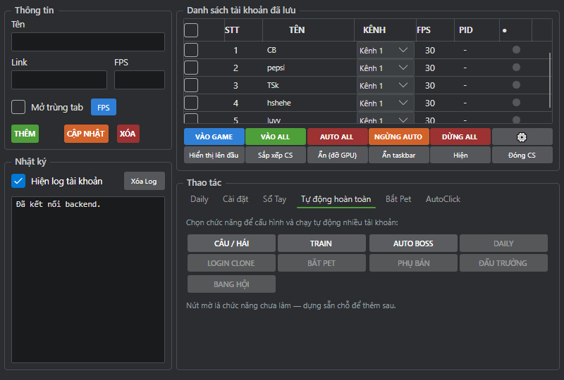

# FEAT-002 — Đăng nhập tự động

| Trường | Giá trị |
|---|---|
| **Mã tính năng** | FEAT-002 |
| **Tên tính năng** | Đăng nhập tự động |
| **Nhóm chức năng** | Hệ thống nền |
| **Vị trí trên giao diện** | Cửa sổ chính → nút "VÀO GAME" (tài khoản đang tick) / "VÀO ALL" (tất cả) |
| **Độ ưu tiên** | Cao |
| **Trạng thái** | ✅ Hoàn thiện |
| **Đã kiểm chứng trên game thật** | Có — dùng liên tục, nhiều lần trong ngày 2026-08-24 |
| **Cập nhật lần cuối** | 2026-08-24 |

---

## 1. Mục tiêu nghiệp vụ

Tự mở game và đăng nhập vào đúng nhân vật, để mọi tính năng khác có client
sẵn sàng làm việc. Đây là bước đầu tiên của mọi luồng tự động.

## 2. Phạm vi

**Trong phạm vi:** mở game bằng link đăng nhập, bấm Bắt đầu, chọn kênh, chọn
đúng nhân vật theo vị trí đã lưu, chờ tới khi thật sự vào được bản đồ, tự xử
lý hộp thoại lỗi đăng nhập.

**Ngoài phạm vi (cố ý không làm):**
- **Không bao giờ bấm nút "Bắt buộc"** trong hộp thoại "tài khoản đang đăng
  nhập nơi khác" — đá phiên người khác ra không thuộc thẩm quyền của tool
- Không tự gia hạn link hết hạn

## 3. Tác nhân

| Tác nhân | Vai trò |
|---|---|
| Người dùng | Tick tài khoản, bấm VÀO GAME |
| Tool | Mở game, điều hướng qua các màn hình đăng nhập |
| Game (client Flash) | Xác thực và tải bản đồ |

## 4. Điều kiện tiên quyết

| # | Điều kiện |
|---|---|
| PRE-01 | Đã cấu hình đường dẫn tới `flash.exe` (tab Cài đặt) — thiếu thì bỏ qua và báo "Chưa cấu hình flash.exe" |
| PRE-02 | Tài khoản có **Link đăng nhập còn hạn** |
| PRE-03 | Tài khoản có **Vị trí đăng nhập** (1–3) đúng với vị trí nhân vật trong game ⚠️ xem BUG-01 ở FEAT-001 |

## 5. Dữ liệu đầu vào

| Trường | Kiểu | Bắt buộc | Nguồn | Ghi chú |
|---|---|---|---|---|
| Danh sách tài khoản | Chọn | Có | Tick trong bảng (VÀO ALL = tất cả) | |
| Link đăng nhập | Chữ | Có | Lấy từ hồ sơ tài khoản | |
| Vị trí đăng nhập | 1/2/3 | Có | Lấy từ hồ sơ tài khoản | |
| Đường dẫn flash.exe | Chữ | Có | Cấu hình chung | |

## 6. Luồng chính

| Bước | Ai làm | Hành động | Kết quả mong đợi |
|---|---|---|---|
| 1 | Tool | Mở `flash.exe` kèm link đăng nhập (mỗi tài khoản một luồng riêng, giãn 0,2 giây) | Cửa sổ game xuất hiện |
| 2 | Tool | Chờ cửa sổ hiện (tối đa 15 giây), **đổi tiêu đề cửa sổ thành tên tài khoản** | Nhận diện được client của ai |
| 3 | Tool | Kiểm tra trước: nếu đã ở trong bản đồ rồi thì kết thúc luôn, **không bấm gì** | Tránh thao tác thừa |
| 4 | Tool | Nhận đúng nút "Bắt đầu" trên ảnh rồi mới bấm | Vào màn chọn kênh |
| 5 | Tool | Nhận các ô kênh bằng màu, **chọn ngẫu nhiên một kênh** | Vào màn chọn nhân vật |
| 6 | Tool | Chờ danh sách nhân vật hiện thật, bấm đúng thẻ theo Vị trí (1/2/3) | Thẻ nhân vật được chọn |
| 7 | Tool | **Xác minh lại thẻ đã sáng** (tối đa 4 lần, mỗi lần chờ 1 giây) rồi mới bấm "Vào game" | Chắc chắn đúng nhân vật |
| 8 | Tool | Chờ vào bản đồ: chấp nhận khi đọc được nhân vật trong bộ nhớ, **hoặc** 3 khung hình liên tiếp thấy giao diện trong game | Đã vào game |
| 9 | Tool | Giữ client mở, lưu ảnh bằng chứng | Client sẵn sàng cho tính năng khác |

## 7. Luồng thay thế

**ALT-01 — Hộp thoại lỗi đăng nhập (link hết hạn / đang đăng nhập nơi khác)**
*Xảy ra khi:* xuất hiện hộp thoại cảnh báo.
*Xử lý:* nhận diện bằng **2 khung hình liên tiếp** (chống nhận nhầm), bấm nút
"Có", rồi quay lại bấm "Bắt đầu". Tối đa **5 lần**, sau đó báo lỗi kèm ảnh.
**Không bao giờ bấm "Bắt buộc".**

**ALT-02 — Chưa thấy danh sách kênh sau 4 giây**
*Xử lý:* quay lại bấm "Bắt đầu" lần nữa.

**ALT-03 — Đã bấm "Vào game" nhưng vẫn ở màn chọn nhân vật**
*Xử lý:* bấm lại "Vào game", tối đa 3 lần.

**ALT-04 — Ảnh chụp màn hình bị trắng/phẳng (lỗi của một số bản Flash)**
*Xử lý:* sau 5 giây chuyển sang bấm theo toạ độ chuẩn, **nhưng vẫn kiểm tra
bộ nhớ trước mỗi thao tác** để không bấm mù hoàn toàn.

## 8. Luồng ngoại lệ (lỗi)

| Mã | Tình huống | Hệ thống xử lý | Người dùng thấy gì |
|---|---|---|---|
| EX-01 | Chưa cấu hình flash.exe | Bỏ qua tài khoản đó | "Chưa cấu hình flash.exe" |
| EX-02 | Hộp thoại lỗi quá 5 lần | Dừng, lưu ảnh chẩn đoán | Lỗi kèm đường dẫn ảnh `logs/auto_start_frames/attempt_N_login_alert.png` |
| EX-03 | Cửa sổ game bị đóng giữa chừng | Dừng | Thất bại |
| EX-04 | Hết thời gian chờ (150 giây) | Lưu ảnh `timeout_final`, đóng client | Thất bại |

## 9. Quy tắc nghiệp vụ

| Mã | Quy tắc |
|---|---|
| BR-01 | Thời gian chờ tối đa **150 giây** (khi gọi từ Câu/Hái là 180 giây) |
| BR-02 | Tối đa **5 lần** bấm lại sau hộp thoại lỗi; tối đa **3 lần** bấm "Vào game" |
| BR-03 | **Tuyệt đối không bấm "Bắt buộc"** trong hộp thoại đang đăng nhập nơi khác |
| BR-04 | Nhận diện hộp thoại lỗi cần **cả 2 chỉ báo đồng ý** và **2 khung hình liên tiếp** — không chắc thì không hành động |
| BR-05 | Chọn kênh **ngẫu nhiên**, không dùng giá trị cột "Kênh" trên bảng |
| BR-06 | **Không đổi kích thước cửa sổ game** — toạ độ chuẩn được chiếu vào khung hình thật theo tỉ lệ |
| BR-07 | Xác nhận vào game bằng **bộ nhớ** (chính xác) hoặc 3 khung hình liên tiếp (dự phòng) — không chỉ chờ hết giờ |

## 10. Kết quả đầu ra

| Loại | Nội dung |
|---|---|
| Trạng thái trả về | Thành công/thất bại + mã tiến trình + mã cửa sổ + tên tài khoản |
| Ghi log | Mỗi giai đoạn: mở cửa sổ, bấm Bắt đầu, chọn kênh, chọn nhân vật, vào bản đồ |
| Ảnh bằng chứng | `logs/auto_start_frames/` — `before_start`, `before_channel`, `before_character`, `character_selected`, `after_enter`, `map_pass`, `login_alert`, `timeout_final` |

## 11. Điều kiện dừng

Vào bản đồ thành công (giữ client mở) · hết thời gian chờ · hộp thoại lỗi quá
5 lần · cửa sổ game bị đóng · người dùng dừng.

## 12. Tiêu chí chấp nhận

| Mã | Tiêu chí |
|---|---|
| AC-01 | **Cho trước** tài khoản có link còn hạn, **Khi** bấm VÀO GAME, **Thì** game mở và vào đúng bản đồ trong vòng 150 giây |
| AC-02 | **Cho trước** tài khoản có nhân vật ở vị trí 2, **Khi** đăng nhập, **Thì** chọn đúng nhân vật vị trí 2 *(hiện tại phụ thuộc BUG-01 ở FEAT-001)* |
| AC-03 | **Cho trước** hiện hộp thoại "đang đăng nhập nơi khác", **Khi** tool xử lý, **Thì** bấm "Có" và KHÔNG BAO GIỜ bấm "Bắt buộc" |
| AC-04 | **Cho trước** client đã ở trong game sẵn, **Khi** gọi đăng nhập, **Thì** tool nhận ra và kết thúc ngay, không bấm gì |
| AC-05 | **Cho trước** đăng nhập xong, **Khi** kiểm tra tiêu đề cửa sổ, **Thì** phải bằng đúng tên tài khoản |

## 13. Giao diện liên quan

## 14. Trạng thái hiện tại & khoảng trống

**Đã làm được:** toàn bộ luồng, kể cả xử lý hộp thoại lỗi và trường hợp ảnh
chụp bị trắng.

**Chưa làm / còn thiếu:**
- Nút "VÀO GAME" **không có vòng thử lại** — hỏng là hỏng luôn. (Riêng luồng
  Daily có thử lại 3 lần.) Cân nhắc thêm thử lại cho nút này.
- Không dùng giá trị "Kênh" người dùng chọn — luôn chọn kênh ngẫu nhiên.

## 15. Câu hỏi mở (cần chủ dự án trả lời)

| # | Câu hỏi | Người trả lời |
|---|---|---|
| Q-01 | Nút VÀO GAME có cần thêm cơ chế tự thử lại 2-3 lần như Daily không? | Chủ dự án |
| Q-02 | Có muốn đăng nhập vào **đúng kênh đã chọn** thay vì kênh ngẫu nhiên không? | Chủ dự án |

## 16. Tham chiếu kỹ thuật (dành cho dev)

| Mục | Giá trị |
|---|---|
| Module chính | `app/single_auto_start.py` (`SingleAccountAutoStart`) |
| Module hỗ trợ | `app/login_state.py` (nhận diện hộp thoại lỗi bằng đo màu) |
| Cơ chế | Quét ảnh + click; xác nhận vào game bằng đọc bộ nhớ |
| Lệnh backend | `login` |
| Toạ độ chuẩn (khung 900×590) | Bắt đầu (450,464); Vào game (314,502); thẻ nhân vật x=315/450/586, y=419; nút "Có" (450,317) |
| Module di sản (không dùng) | `app/multi_login.py` |

## 17. Bổ sung bắt buộc — FPS sau login (2026-08-29)

- Giá trị `fps` đã lưu trong bảng/account config là FPS mặc định của chính
  account đó.
- Bất kể login/relogin được gọi từ Daily, Trừ Ma, Trị An, Train, recovery hay
  nút riêng, luồng bắt buộc là:
  `MAP_READY -> APPLY_FPS -> FPS_CONFIRMED -> cho phép feature chạy`.
- Nếu FPS đã đúng thì chỉ ghi readback, không click lại. Nếu khác thì đặt bằng
  guarded UI action trên đúng HWND/PID generation và xác minh ổn định ít nhất
  hai mẫu.
- Không hard-code 150, không lấy FPS account khác. Config rỗng/sai hoặc readback
  UNKNOWN phải fail-closed/recovery có giới hạn.
- Relogin, process restart hoặc PID reuse tạo generation mới và bắt buộc xác
  minh/áp FPS lại trước thao tác game đầu tiên.
