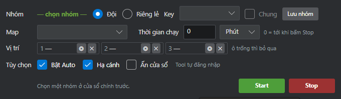

# FEAT-030 — Train (luyện cấp tự động)

| Trường | Giá trị |
|---|---|
| **Mã tính năng** | FEAT-030 |
| **Tên tính năng** | Train (luyện cấp tự động) |
| **Nhóm chức năng** | Tính năng độc lập |
| **Vị trí trên giao diện** | Tab "Tự động hoàn toàn" → nút "TRAIN" → mở cửa sổ "Tự động Train" |
| **Độ ưu tiên** | Cao |
| **Trạng thái** | ✅ Hoàn thiện |
| **Đã kiểm chứng trên game thật** | Có (các phiên trước, xem sổ quyết định) |
| **Cập nhật lần cuối** | 2026-08-24 |

---

## 1. Mục tiêu nghiệp vụ

Cho một đội nhân vật tự động đi qua lại trên bản đồ để gặp quái hoang, rồi để
chức năng Auto có sẵn của game tự đánh — giúp lên cấp và cày kinh nghiệm mà
không cần ngồi canh. Chạy được nhiều tài khoản cùng lúc theo đội hình.

## 2. Phạm vi

**Trong phạm vi:**
- Tự đăng nhập (hoặc bám vào client người chơi đã mở sẵn)
- Tự lập nhóm, di chuyển cả đội tới bản đồ đã chọn
- Đi qua lại giữa các NPC làm mốc để chạm mặt quái
- Đếm số trận đã đánh, đủ số trận thì sang bản đồ kế tiếp
- Tự phục hồi khi gặp sự cố (rớt nhóm, Auto tắt, client treo…)

**Ngoài phạm vi (cố ý không làm):**
- Không tự chọn kỹ năng/đánh thủ công — dùng Auto của game
- Mặc định **chỉ nhân vật chủ (KEY) đi bộ**, thành viên đứng yên đánh theo
  nhóm (giảm 3 lần số lệnh gửi vào game, vì đây là nguyên nhân treo client
  lớn nhất)

## 3. Tác nhân

| Tác nhân | Vai trò |
|---|---|
| Người dùng | Chọn nhóm, bản đồ, thời gian chạy, các tuỳ chọn; bấm Start |
| Tool | Đăng nhập, lập nhóm, di chuyển, điều khiển đi tuần, giám sát |
| Game (client Flash) | Chức năng Auto tự đánh quái khi vào trận |

## 4. Điều kiện tiên quyết

| # | Điều kiện |
|---|---|
| PRE-01 | Đã chọn **một nhóm** ở cửa sổ chính — không chọn thì tool từ chối chạy |
| PRE-02 | Nhóm phải có ít nhất 1 tài khoản |
| PRE-03 | Chế độ **tự đăng nhập**: phải cấu hình sẵn đường dẫn `flash.exe` trong Cài đặt, nếu trống thì dừng ngay |
| PRE-04 | Chế độ **bám client có sẵn**: người chơi phải tự đăng nhập trước, và tiêu đề cửa sổ game phải trùng đúng tên tài khoản |
| PRE-05 | Bản đồ muốn train phải nằm trong danh mục bản đồ đã đo sẵn của tool |

**Không cần:** vào sẵn bản đồ, lập nhóm sẵn, hay chọn NPC — tool tự làm hết.

## 5. Dữ liệu đầu vào

| Trường trên giao diện | Kiểu | Bắt buộc | Giá trị hợp lệ | Mặc định | Ghi chú |
|---|---|---|---|---|---|
| Nhóm | Chọn | Có | Nhóm đã lưu | — | Chọn ở cửa sổ chính |
| Đội / Riêng lẻ | Chọn 1 | Có | Đội hoặc Riêng lẻ | Đội | "Riêng lẻ" = mỗi tài khoản tự đi, không lập nhóm |
| Key | Chọn | Không | Tài khoản trong nhóm | Tự chọn | Nhân vật chủ, người mời nhóm và dẫn đường |
| Map | Chọn | Có | Bản đồ có trong danh mục | Lạp Tuyết Địa | Có thể chọn nhiều bản đồ, chạy lần lượt |
| Thời gian chạy | Số (phút) | Không | ≥ 0 | 0 | 0 = chạy tới khi bấm Stop |
| Vị trí 1 / 2 / 3 | Chọn | Không | NPC trên bản đồ | Trống | Trống = tool tự chọn 2 NPC xa nhau nhất |
| Bật Auto | Bật/Tắt | Không | — | Bật | Tự bật lại công tắc Auto của game khi bị tắt |
| Hạ cánh | Bật/Tắt | Không | — | Bật | Bắt nhân vật đi bộ (bay thì không gặp quái) |
| Ẩn cửa sổ | Bật/Tắt | Không | — | Tắt | Ẩn client khi chạy, tự hiện lại khi dừng |

## 6. Luồng chính

| Bước | Ai làm | Hành động | Kết quả mong đợi |
|---|---|---|---|
| 1 | Người dùng | Chọn nhóm, bản đồ, tuỳ chọn → bấm Start | Tool bắt đầu một vòng chạy |
| 2 | Tool | Đăng nhập tất cả tài khoản (mỗi tài khoản cách nhau 4 giây, tối đa 2 lần thử) **hoặc** bám vào client đang mở | Tất cả tài khoản đã vào game |
| 3 | Tool | Dọn các thông báo vừa hiện lúc vào game (chỉ những loại được phép đóng) | Màn hình sạch |
| 4 | Tool | Bật công tắc Auto cho tất cả tài khoản | Auto đang bật |
| 5 | Tool | Nhân vật chủ mời các thành viên vào nhóm | Nhóm đã lập |
| 6 | Tool | Nhân vật chủ mở bản đồ thế giới, chọn điểm đến, chọn "đưa cả đội" | Cả đội cùng dịch chuyển |
| 7 | Tool | Chờ tối đa 25 giây, kiểm tra mỗi giây xem **tất cả** đã tới đúng bản đồ chưa | Tất cả ở đúng bản đồ |
| 8 | Tool | Bật lại Auto và lập lại nhóm cho chắc | Sẵn sàng train |
| 9 | Tool | Bắt nhân vật hạ cánh (đi bộ) | Nhân vật đi bộ |
| 10 | Tool | Xác định 2 NPC làm mốc đường đi (người dùng chọn, hoặc 2 NPC xa nhau nhất) | Có lộ trình đi tuần |
| 11 | Tool | Ra lệnh cho nhân vật đi tới NPC mốc hiện tại | Nhân vật đi bộ, gặp quái thì vào trận |
| 12 | Tool | Khi đang trong trận: dừng điều khiển, để Auto của game đánh | Trận đấu diễn ra |
| 13 | Tool | Khi tới nơi (còn ≤170 đơn vị) hoặc đứng ì 3 giây → đổi sang NPC mốc kia | Tiếp tục đi, quét vùng đất mới |
| 14 | Tool | Đếm số trận: mỗi lần chuyển từ "không đánh" sang "đang đánh" = 1 trận | Bộ đếm tăng |
| 15 | Tool | Đủ số trận yêu cầu cho **mọi** tài khoản → sang bản đồ kế tiếp | Lặp lại từ bước 6 |
| 16 | Tool | Hết bản đồ → báo hoàn thành | Kết thúc |

## 7. Luồng thay thế

**ALT-01 — Di chuyển cả đội thất bại**
*Xảy ra khi:* sau 25 giây không xác nhận được tất cả đã tới nơi.
*Xử lý:* chuyển sang di chuyển **từng tài khoản một** (mỗi tài khoản tối đa 2
lần thử, mỗi lần chờ 75 giây).

**ALT-02 — Không chọn NPC mốc**
*Xảy ra khi:* người dùng để trống ô Vị trí.
*Xử lý:* tool tự lấy **2 NPC xa nhau nhất** trên bản đồ — quãng đường dài nhất
băng qua nhiều vùng quái nhất.

**ALT-03 — Lập nhóm không đủ người**
*Xảy ra khi:* mời nhóm nhưng thiếu thành viên.
*Xử lý:* vẫn chạy tiếp, trừ khi bật tuỳ chọn "bắt buộc có nhóm" thì dừng vòng.

## 8. Luồng ngoại lệ (lỗi)

| Mã | Tình huống | Hệ thống xử lý | Người dùng thấy gì |
|---|---|---|---|
| EX-01 | Đăng nhập thất bại (chế độ tự đăng nhập) | Thử lại 1 lần (chờ 12s); vẫn hỏng → đóng client tool tự mở, chờ 10 giây, **chạy lại từ đầu** | "LOGIN_FAILED" |
| EX-02 | Không tìm thấy client (chế độ bám) | **Dừng hẳn**, không tự mở lại | "ATTACH_FAILED" |
| EX-03 | Client chết hoặc treo | Kết thúc bản đồ; chế độ tự đăng nhập thì khởi động lại, chế độ bám thì dừng hẳn | "CLIENT_LOST" |
| EX-04 | Thông báo/hộp thoại chặn đường đi | Cứ 20 giây quét và đóng — **chỉ đóng loại được phép**, không bao giờ đụng vào popup là chức năng (mời nhóm, nhiệm vụ, cửa hàng) | Log popup đã đóng |
| EX-05 | Thành viên rớt nhóm | Cứ 45 giây kiểm tra, ai rớt thì **mời lại**, không phá vòng chạy | "PARTY_LOST" |
| EX-06 | Auto tự tắt (hết lượt) | Cứ 120 giây đọc lại và bật lại Auto | Log cảnh báo |
| EX-07 | Không có trận nào trong 300 giây (kẹt) | Kết thúc bản đồ → khởi động lại hoặc dừng tuỳ chế độ | "STALLED" |
| EX-08 | Bản đồ không có trong danh mục | Dừng vòng | "CONFIG_ERROR" |
| EX-09 | Hết thời gian đặt trước | Dừng hẳn | "TIME_UP" |

## 9. Quy tắc nghiệp vụ

| Mã | Quy tắc |
|---|---|
| BR-01 | Không có trận nào trong **300 giây** = coi là kẹt |
| BR-02 | Bật lại Auto mỗi **120 giây**; quét thông báo mỗi **20 giây**; kiểm tra nhóm mỗi **45 giây** |
| BR-03 | Mở client cách nhau **4 giây**; mỗi tài khoản tối đa **2 lần thử** đăng nhập, giữa 2 lần chờ **12 giây** |
| BR-04 | Chờ cả đội tới nơi: **25 giây**; di chuyển riêng lẻ: **75 giây/lần, 2 lần thử** |
| BR-05 | Coi là **đã tới NPC** khi khoảng cách ≤ **170 đơn vị**; chỉ tính "có tiến triển" khi rút ngắn ≥ **8 đơn vị**; đứng ì **3 giây** thì đổi mốc |
| BR-06 | Lệnh đi được phát lại tối đa mỗi **2,5 giây** để nối lại đường sau mỗi trận |
| BR-07 | Mặc định **chỉ nhân vật chủ đi bộ**, thành viên đứng yên đánh theo nhóm |
| BR-08 | Chỉ đóng những client **do chính lượt chạy này mở** khi kết thúc |
| BR-09 | Đếm trận dựa trên **trạng thái trận đánh đọc từ game**, không đếm theo số lần click |

## 10. Kết quả đầu ra

| Loại | Nội dung |
|---|---|
| Trạng thái trả về | Cập nhật lên giao diện mỗi 3 giây: đang chạy, giai đoạn, bản đồ, vòng thứ mấy, nhóm có ổn không, số lần khởi động lại, thời gian đã chạy, và từng tài khoản (số trận theo bản đồ, còn sống không, Auto có bật không) |
| Ghi log | Mỗi lần đổi giai đoạn, mỗi lần vào trận, mỗi lần đổi NPC mốc, thông báo đã đóng, cảnh báo Auto tắt, rớt nhóm |
| File lưu lại | **Không ghi file kết quả riêng** |

## 11. Điều kiện dừng

- Đủ số trận trên mọi bản đồ đã chọn
- Hết thời gian đặt trước
- Người dùng bấm Stop
- Chế độ **bám client**: gặp bất kỳ sự cố nào cũng dừng
- Chế độ **tự đăng nhập**: sự cố KHÔNG dừng — tự khởi động lại vòng, lặp vô hạn

## 12. Tiêu chí chấp nhận

| Mã | Tiêu chí |
|---|---|
| AC-01 | **Cho trước** nhóm 3 tài khoản, bản đồ Lạp Tuyết Địa, 3 trận/bản đồ, **Khi** chạy, **Thì** cả 3 tài khoản đều đạt đủ 3 trận rồi mới chuyển bản đồ |
| AC-02 | **Cho trước** đang train, **Khi** một thành viên rớt nhóm, **Thì** tool mời lại trong vòng 45 giây mà không dừng vòng chạy |
| AC-03 | **Cho trước** đang train, **Khi** Auto trong game tự tắt, **Thì** tool bật lại trong vòng 120 giây |
| AC-04 | **Cho trước** không chọn NPC mốc, **Khi** chạy, **Thì** tool tự chọn 2 NPC xa nhau nhất trên bản đồ |
| AC-05 | **Cho trước** có hộp thoại mời nhóm đang hiện, **Khi** tool dọn thông báo, **Thì** tool KHÔNG đóng hộp thoại đó |

## 13. Giao diện liên quan

## 14. Trạng thái hiện tại & khoảng trống

**Đã làm được:** toàn bộ luồng ở mục 6, kèm đầy đủ cơ chế tự phục hồi.

**Chưa làm / còn thiếu:**
- Có một tuỳ chọn tên `infinite_auto` nằm trong cấu hình nhưng **không được
  dùng tới** — có vẻ là tàn dư, cần xoá hoặc nối lại (xem Q-01)

## 15. Câu hỏi mở (cần chủ dự án trả lời)

| # | Câu hỏi | Người trả lời |
|---|---|---|
| Q-01 | Tuỳ chọn "Auto vô hạn" có cần tích hợp thẳng vào Train không, hay cứ để bấm riêng bằng nút "AUTO ALL" ở cửa sổ chính? | Chủ dự án |
| Q-02 | Ô "Vị trí 3" trên giao diện có ý nghĩa gì? Hiện tool chỉ đi qua lại giữa 2 NPC — có cần đi tuần qua 3 điểm không? | Chủ dự án |
| Q-03 | Ghi chú trên giao diện ghi "Chọn một nhóm ở cửa sổ chính trước" — cấu hình nhóm nằm ở đâu trên giao diện hiện tại? | Chủ dự án |

## 16. Tham chiếu kỹ thuật (dành cho dev)

| Mục | Giá trị |
|---|---|
| Module chính | `app/auto_train.py` (`AutoTrainer`, `TrainConfig`) |
| Module hỗ trợ | `app/npc_patrol.py` (đi tuần), `app/party_rpc.py` (lập nhóm), `app/map_travel.py` (di chuyển), `app/client_health.py` (phát hiện treo) |
| Cơ chế | Đọc/gọi bộ nhớ (vị trí, trạng thái trận, ra lệnh đi) + quét ảnh (công tắc Auto, trạng thái bay) |
| Lệnh backend | `train_start`, `train_stop` |
| Mục sổ quyết định liên quan | AUTO_TRAIN_DECISIONS.md — mục 86, 118-124 (nguyên nhân treo client) |
